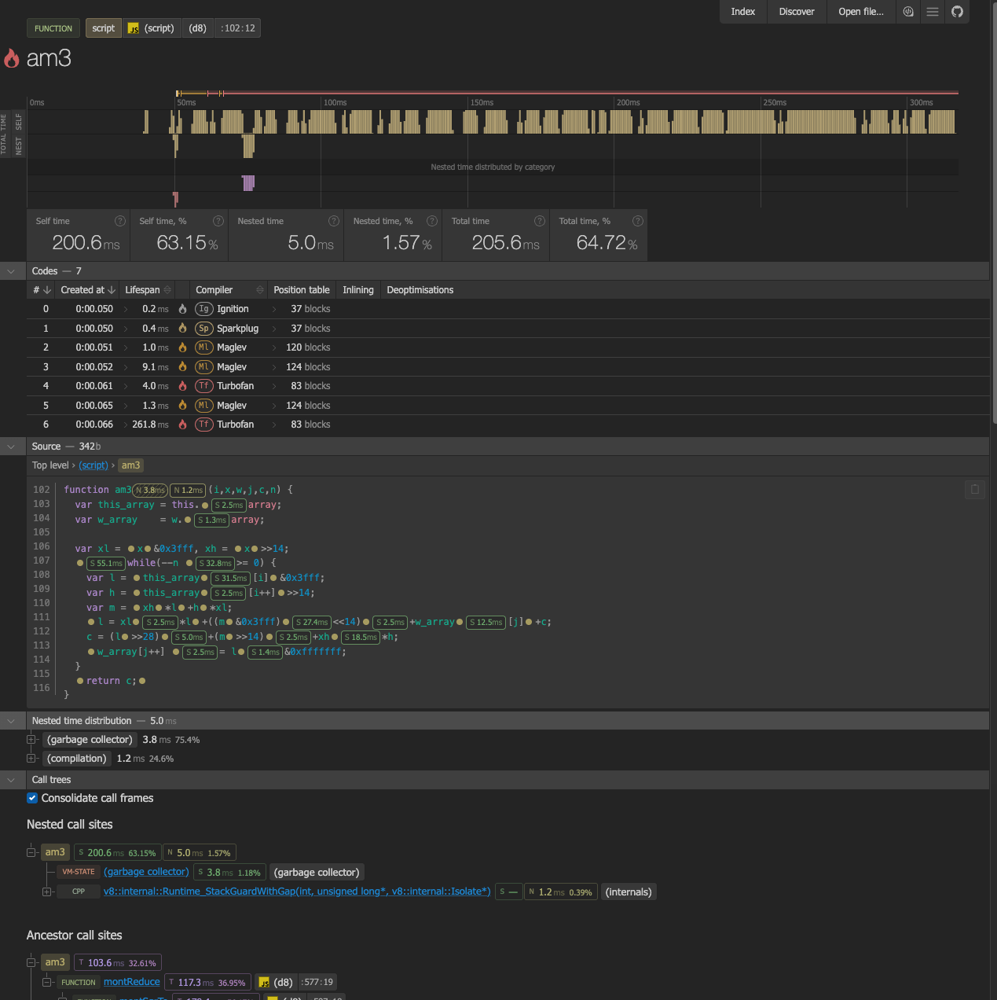

# CPUpro

A fork from https://github.com/discoveryjs/cpupro focused entirely on `d8` execution.

Rethinking of CPU profile analysis and processing. Focused on profiles and logs of any size collected in V8 runtimes: Node.js, Deno and Chromium browsers.

Supported formats:

* [V8 log](https://v8.dev/docs/profile) (.log)
* [V8 log preprocessed](https://v8.dev/docs/profile#web-ui-for---prof) with --preprocess (.json)
* [V8 CPU profile](https://nodejs.org/docs/latest/api/cli.html#--cpu-prof) (.cpuprofile)
* [Chromium Performance Profile](https://developer.chrome.com/docs/devtools/performance/reference#save) (.json)
* [Edge Enhanced Performance Traces](https://learn.microsoft.com/en-us/microsoft-edge/devtools-guide-chromium/experimental-features/share-traces) (.devtools)

> The file extension can be arbitrary; the format is determined based on the file's content.  
> The file content may be compressed using `gzip` or `deflate`.

## Usage Scenarios

This fork includes the `d8pro` wrapper script designed for seamless profiling using `d8`. It automatically injects `--prof` and handles trace processing for you.

**Requirements:**
- A local checkout of the V8 repository.
- A macOS or Linux operating system.

### Scenario #1 - Basic Profiling, Flamecharts & Call Trees

**Goal:** Identify performance bottlenecks by exploring hierarchical views of function execution time (Self vs. Total), viewing flamecharts on a time ruler, and mapping execution back to the original JavaScript source code.

Run `d8pro` followed by any standard `d8` arguments. The wrapper will inject `--prof`, run your target file, process the output `v8.log` automatically using the V8 tick processor to get JS JIT symbols, and open `cpupro`.

```sh
d8pro my-script.js
```

*Optional:* Adjust sampling interval (default is 1000 microseconds):
```sh
d8pro --prof-sampling-interval=500 my-script.js
```



### Scenario #2 - Inspecting Bytecode & Assembly

**Goal:** Perform deep inspection of the generated V8 bytecode and native assembly instructions for JIT-compiled functions.

Pass the `--log-code-disassemble` flag when running `d8pro`.
```sh
d8pro --log-code-disassemble my-script.js
```

### Scenario #3 - Debugging Compiler Graphs (Turbofan / Turboshaft)

**Goal:** Render and explore Turbofan/Turboshaft compiler graphs. This is extremely useful for debugging V8 optimizations, viewing phase changes, and exploring generated IR.

Provide the `--trace-turbo` flag to generate `turbo-*.json` and `turbo.cfg` files.
```sh
d8pro --trace-turbo my-script.js
```
The `d8pro` wrapper automatically detects these trace files and passes them to the UI using the `cpupro --turbofan <path>` flag.

### Scenario #4 - Tracking Deoptimizations

**Goal:** Highlight functions that were deoptimized by V8 and track the reasons/bailouts for the deoptimization.

Enable deoptimization tracking with the `--log-deopt` flag.
```sh
d8pro --log-deopt my-script.js
```

### Scenario #5 - Tracking Memory & Allocations

**Goal:** Analyze memory allocation metrics and garbage collection behavior to identify excessive object creation.

While detailed `allocationProfile` data is typically collected via Chromium/Edge DevTools enhanced traces, you can track minor and major garbage collection events in `d8` by providing GC-related flags along with your profiling.

```sh
d8pro --trace-gc my-script.js
```
The `--trace-gc` flag will log garbage collection events, and `cpupro` can display memory metrics and allocation samples if they are included in the generated trace.

### Scenario #6 - Using `cpupro` CLI

CLI allows to generate a report (a viewer with embedded data) from a profile file.

To use CLI install `cpupro` globally using `npm install -g cpupro`, or use `npx cpupro`.

- open viewer without embedded data in default browser:
  ```sh
  cpupro
  ```
- open viewer with `test.cpuprofile` data embedded:
  ```sh
  cpupro test.cpuprofile
  ```
- open viewer with data embedded from `stdin`:
  ```sh
  cpupro - <test.cpuprofile
  ```
  ```sh
  cat test.cpuprofile | cpupro -
  ```
- get usage information:
  ```sh
  cpupro -h
  ```
  ```
  Usage:
  
      cpupro [filepath] [options]
  
  Options:
  
      -f, --filename <filename>    Specify a filename for a report; should ends with .htm or .html,
                                   otherwise .html will be added
      -h, --help                   Output usage information
      -n, --no-open                Prevent open a report in browser, the report will be written to file
      -o, --output-dir <path>      Specify an output path for a report (current working dir by default)
      -v, --version                Output version
  ```

## License

MIT
